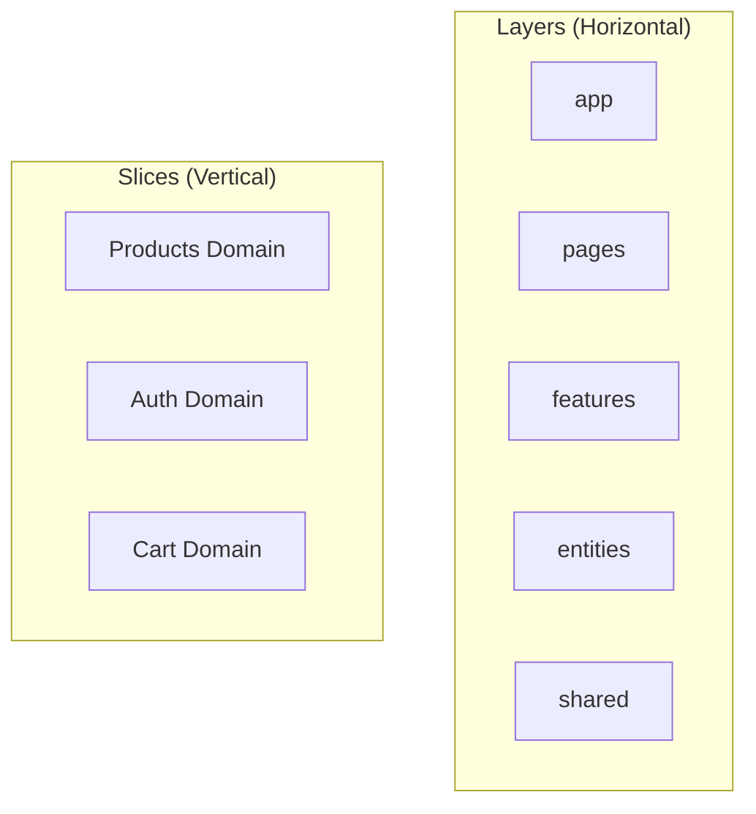
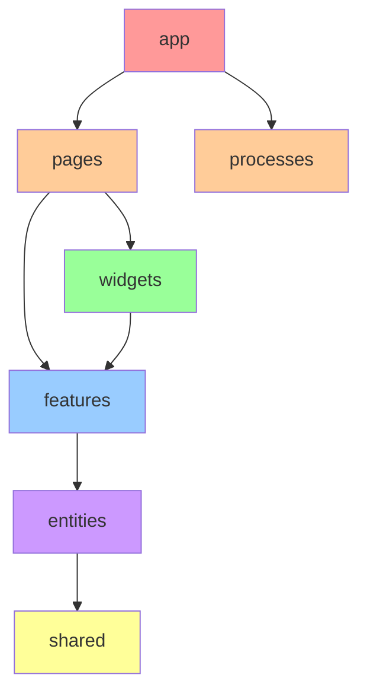

# Feature Slice Architecture with React
Building Scalable Applications

---

# About this Talk

<v-click>

- Feature Slice Architecture overview
- Core principles and benefits
- React implementation
- Real-world examples
- Best practices
- Migration strategies

</v-click>

<div class="abs-br m-6 flex gap-2">
  <div class="text-5xl text-blue-600">
    25 mins
  </div>
  <div class="text-2xl text-gray-400">
    + Q&A
  </div>
</div>

---
layout: center
---

# Why Do We Need FSA?

---

# Common Frontend Problems

<div class="grid grid-cols-2 gap-4">

<div>
<v-click>

## Challenges
- Codebase becomes a "big ball of mud"
- Feature boundaries are blurred
- Cross-team collaboration is difficult
- Code reuse leads to tight coupling
- Business logic scattered across app
- Tech debt accumulates rapidly

</v-click>
</div>

<div>
<v-click>

## Real-world Scenarios
- Multiple teams working on same codebase
- Features need to be toggled per client
- Complex state management
- Shared components become bottlenecks
- Testing becomes complicated
- Onboarding new developers is challenging

</v-click>
</div>

</div>

---

# How FSA Solves These Problems

<v-click>

### Clear Boundaries

```ts {all|1-2|4-5}
// ❌ Before: Importing from anywhere
import { Button } from '../../../components/Button'

// ✅ After: Clear public API
import { Button } from '@/shared/ui'
```

</v-click>

<v-click>

### Business Logic Isolation

```ts {all|1-6|8-13}
// ❌ Before: Mixed concerns
const ProductList = () => {
  const [products, setProducts] = useState([])
  const [cart, setCart] = useState([])
  // Mixed product and cart logic
}

// ✅ After: Separated features
const ProductList = () => {
  const { products } = useProducts()
  const { addToCart } = useCart()
  // Only product list logic
}
```

</v-click>

---

# Understanding FSA Structure

<div class="grid grid-cols-2 gap-4">

<div>
<v-click>

## Layers (Horizontal)
- app (Application setup)
- pages (Routing)
- features (User interactions)
- entities (Business objects)
- shared (Common code)

</v-click>
</div>

<div>
<v-click>

## Slices (Vertical)
Each business domain can span multiple layers:

```
src/
  features/
    products/    # Products slice
    auth/        # Auth slice
  entities/
    product/     # Products slice
    user/        # Auth slice
```

</v-click>
</div>

</div>

<v-click>



</v-click>

---

# Layer Dependencies
<div class="grid grid-cols-2 gap-4">

<div>
<v-click>


</v-click>
</div>

<div>
<v-click>

- Upper layers can import from lower layers
- Lower layers CANNOT import from upper layers
- Shared layer has no external dependencies

</v-click>
</div>
</div>


---

# Project Structure Comparison

<div class="grid grid-cols-2 gap-4">

<div>
<v-click>

## Traditional

```
src/
  components/
    Button.tsx
    Modal.tsx
  containers/
    ProductList.tsx
  reducers/
    products.ts
  services/
    api.ts
```

</v-click>
</div>

<div>
<v-click>

## FSA

```
src/
  features/
    product-list/
      ui/
      model/
      api/
    cart/
      ui/
      model/
  entities/
    product/
  shared/
    ui/
```

</v-click>
</div>

</div>

---

# Example: E-commerce Feature

<div class="w-full overflow-x-auto max-h-100">
<v-click>

```ts {all|1-7|9-16|18-28} 
// entities/product/model/types.ts
export interface Product {
  id: string
  title: string
  price: number
  image: string
}

// features/product-list/model/products.slice.ts
import { createSlice } from '@reduxjs/toolkit'
import { Product } from '@/entities/product'

interface ProductsState {
  items: Product[]
  loading: boolean
}

// features/product-list/ui/product-list.tsx
export const ProductList = () => {
  const { items, loading } = useProducts()
  
  return (
    <Grid>
      {items.map(product => <ProductCard product={product} />)}
    </Grid>
  )
}
```

</v-click>
</div>

---

# Implementation Steps
<div class="w-full overflow-x-auto max-h-100">
<v-click>

1. Project Structure Setup
```bash
mkdir -p src/{app,pages,features,entities,shared}
```

2. Define Public API
```ts
// features/product-list/index.ts
export { ProductList } from './ui/product-list'
export type { Product } from './model/types'
```

3. Configure Import Rules
```json
{
  "rules": {
    "boundaries/element-types": [
      "error",
      {
        "default": "disallow",
        "rules": [
          { "from": "features", "allow": ["entities", "shared"] },
          { "from": "entities", "allow": ["shared"] }
        ]
      }
    ]
  }
}
```

</v-click>
</div>

---
layout: center
---

# Q&A

Ask me anything about Feature Slice Architecture!

---
layout: end
---

# Thank You!

Resources:
- 📘 [Feature-Sliced Design documentation](https://feature-sliced.design)
- 💻 [Example repository](https://github.com/feature-sliced/examples)
- 🌟 [Community](https://t.me/feature_sliced)
```