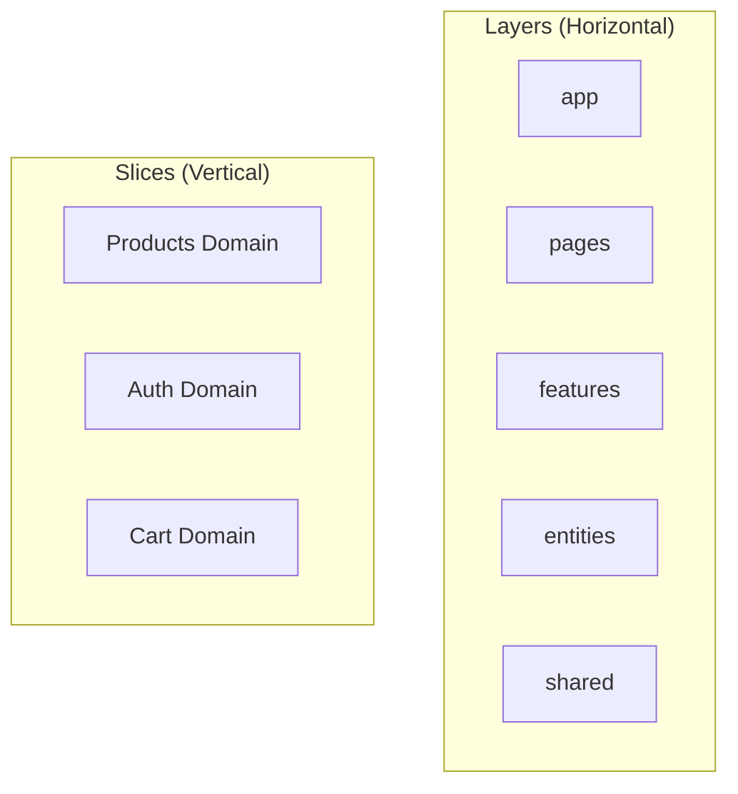
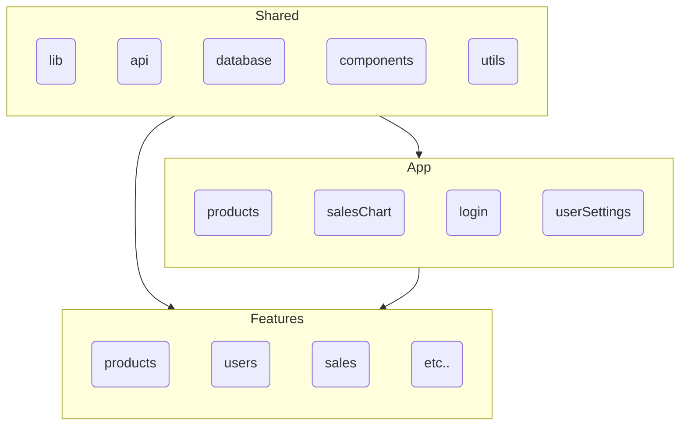

# Feature Slice Architecture with React
Building Scalable Applications

---

# About this Talk

<v-click>

- Feature Slice Architecture overview
- Core principles and benefits
- FSA vs Traditional Approaches
- React implementation
- Real-world examples
- Best practices **
- Migration strategies **

</v-click>

<div class="abs-br m-6 flex gap-2">
  <div class="text-5xl text-blue-600">
    25 mins
  </div>
  <div class="text-2xl text-gray-400">
    + Q&A
  </div>
</div>
---
layout: default
---

# What is Feature Sliced Architecture?

A methodology for organizing frontend code that:
- Focuses on business domains (features)
- Enforces strict boundaries
- Promotes modular design
- Makes codebases more maintainable

---
layout: default
---

# Understanding FSA Structure

<div class="grid grid-cols-2 gap-4">

<div>
<v-click>

## Layers (Horizontal)
- app (Application setup)
- pages (Routing)
- features (User interactions)
- entities (Business objects)
- shared (Common code)

</v-click>
</div>

<div>
<v-click>

## Slices (Vertical)
Each business domain can span multiple layers:

```
src/
  features/
    products/    # Products slice
    auth/        # Auth slice
  entities/
    product/     # Products slice
    user/        # Auth slice
```

</v-click>
</div>

</div>

<v-click>



</v-click>

---

# Layer Dependencies
<div class="grid grid-cols-2 gap-4">

<div>
<v-click>


</v-click>
</div>

<div>
<v-click>

- Upper layers can import from lower layers
- Lower layers CANNOT import from upper layers
- Shared layer has no external dependencies

</v-click>
</div>
</div>


---
layout: center
---

# Why Do We Need FSA?

---

# Common Frontend Problems

<div class="grid grid-cols-2 gap-4">

<div>
<v-click>

## Challenges
- Codebase becomes a "big ball of mud"
- Feature boundaries are blurred
- Cross-team collaboration is difficult
- Code reuse leads to tight coupling
- Business logic scattered across app
- Tech debt accumulates rapidly

</v-click>
</div>

<div>
<v-click>

## Real-world Scenarios
- Multiple teams working on same codebase
- Features need to be toggled per client
- Complex state management
- Shared components become bottlenecks
- Testing becomes complicated
- Onboarding new developers is challenging

</v-click>
</div>

</div>
---
layout: default
---

# Traditional vs FSA: Project Structure
<!-- <div class="w-full overflow-x-auto max-h-100"> -->
<div class="grid grid-cols-2 gap-8">
<div class="w-full overflow-x-auto max-h-100">

## Traditional Approach
```text
src/
  components/                 # Mixed UI components
    Button/
      Button.tsx
      Button.css
    Modal/
    Form/
    ProductCard/
    ShoppingCart/
  
  pages/                     # Pages with mixed logic
    Products.tsx
    Cart.tsx
    Auth.tsx
  
  store/                     # Global state
    actions/
      products.ts
      cart.ts
      auth.ts
    reducers/
      products.ts
      cart.ts
      auth.ts
  
  services/                  # API calls mixed
    api.ts
    auth.ts
    products.ts
  
  utils/                     # Mixed utilities
    helpers.ts
    constants.ts
    types.ts

  hooks/                     # Mixed hooks
    useProducts.ts
    useCart.ts
    useAuth.ts

  contexts/                  # Mixed contexts
    ProductContext.tsx
    CartContext.tsx
    AuthContext.tsx
```

</div>
<div class="w-full overflow-x-auto max-h-100">

## Feature Sliced Approach
```text
src/
  app/                      # App initialization
    providers/
      with-router.tsx
      with-store.tsx
    styles/
    index.tsx
  
  processes/                # Complex flows
    auth/
      ui/
        login-flow.tsx
      model/
        auth-flow.ts
      lib/
        types.ts
  
  pages/                    # Page components
    products/
      ui/
        products-page.tsx
      layouts/
        main-layout.tsx
    cart/
      ui/
        cart-page.tsx
  
  features/                 # User features
    product-list/
      ui/
        product-list.tsx
        product-card.tsx
      model/
        products.slice.ts
      api/
        products.api.ts
    product-search/
      ui/
        search-bar.tsx
      model/
        search.store.ts
    shopping-cart/
      ui/
        cart-widget.tsx
      model/
        cart.context.tsx
      lib/
        hooks.ts
  
  entities/                 # Business objects
    product/
      ui/
        product-image.tsx
        product-price.tsx
      model/
        types.ts
      lib/
        helpers.ts
    user/
      ui/
        user-avatar.tsx
      model/
        types.ts
  
  shared/                   # Shared code
    ui/
      button/
      modal/
    api/
      base.ts
    lib/
      types.ts
```

</div>
</div>

---
layout: two-cols
---

# Key Differences

## Traditional
- Grouped by technical purpose
- Mixed business domains
- Unclear boundaries
- Deep import paths
- Hard to scale
- Complex dependencies
- Hard to maintain
- Difficult team collaboration

::right::

## Feature Sliced
- Grouped by business domain
- Clear feature boundaries  
- Explicit dependencies
- Shallow imports
- Easy to scale
- Team-friendly structure
- Independent deployment
- Better code organization
- Clear responsibility
- Easier testing

---
layout: default
---

# Example: How Imports Work

<div class="grid grid-cols-2 gap-4">
<div>

## Traditional Approach
```ts
// pages/Products.tsx
import { ProductCard } from '../../components/ProductCard'
import { useProducts } from '../../hooks/useProducts'
import { addToCart } from '../../store/actions/cart'
import { Product } from '../../types/product'
import { formatPrice } from '../../utils/formatPrice'
```

</div>
<div>

## Feature Sliced Approach
```ts
// pages/products/ui/products-page.tsx
import { ProductList } from '@/features/product-list'
import { SearchBar } from '@/features/product-search'
import { CartWidget } from '@/features/shopping-cart'
import { PageLayout } from '@/shared/ui/layouts'

// features/product-list/ui/product-list.tsx
import { ProductCard } from '@/entities/product'
import { Button } from '@/shared/ui'
```

</div>
</div>


---

# Example: E-commerce Feature

<div class="w-full overflow-x-auto max-h-100">
<v-click>

```ts {all|1-7|9-16|18-28} 
// entities/product/model/types.ts
export interface Product {
  id: string
  title: string
  price: number
  image: string
}

// features/product-list/model/products.slice.ts
import { createSlice } from '@reduxjs/toolkit'
import { Product } from '@/entities/product'

interface ProductsState {
  items: Product[]
  loading: boolean
}

// features/product-list/ui/product-list.tsx
export const ProductList = () => {
  const { items, loading } = useProducts()
  
  return (
    <Grid>
      {items.map(product => <ProductCard product={product} />)}
    </Grid>
  )
}
```

</v-click>
</div>

---

# Implementation Steps
<div class="w-full overflow-x-auto max-h-100">
<v-click>

1. Project Structure Setup
```bash
mkdir -p src/{app,pages,features,entities,shared}
```

2. Define Public API
```ts
// features/product-list/index.ts
export { ProductList } from './ui/product-list'
export type { Product } from './model/types'
```

3. Configure Import Rules
```json
{
  "rules": {
    "boundaries/element-types": [
      "error",
      {
        "default": "disallow",
        "rules": [
          { "from": "features", "allow": ["entities", "shared"] },
          { "from": "entities", "allow": ["shared"] }
        ]
      }
    ]
  }
}
```

</v-click>
</div>

---
layout: center
---

# Q&A

Ask me anything about Feature Slice Architecture!

---
layout: end
---

# Thank You!

Resources:
- 📘 [Feature-Sliced Design documentation](https://feature-sliced.design)
- 💻 [Example repository](https://github.com/feature-sliced/examples)
- 🌟 [Community](https://t.me/feature_sliced)
```